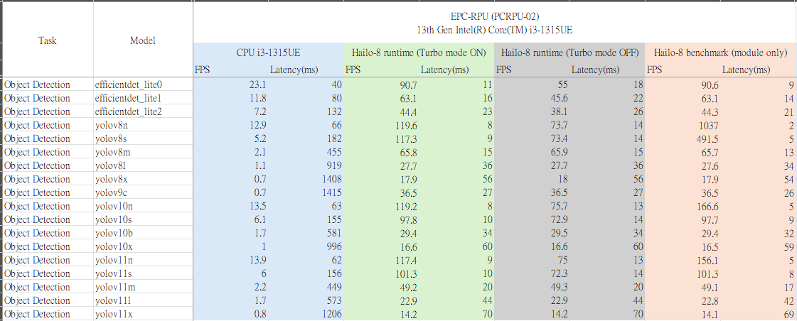
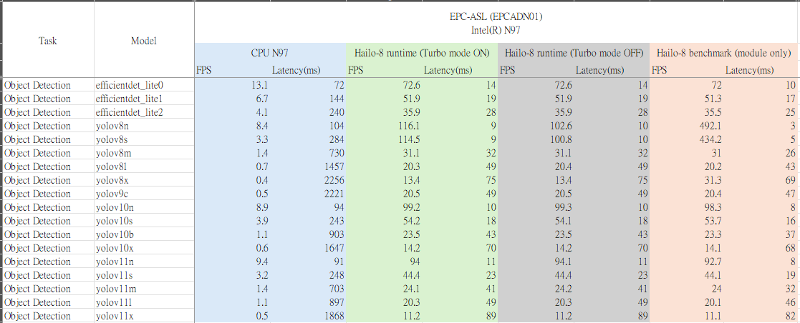
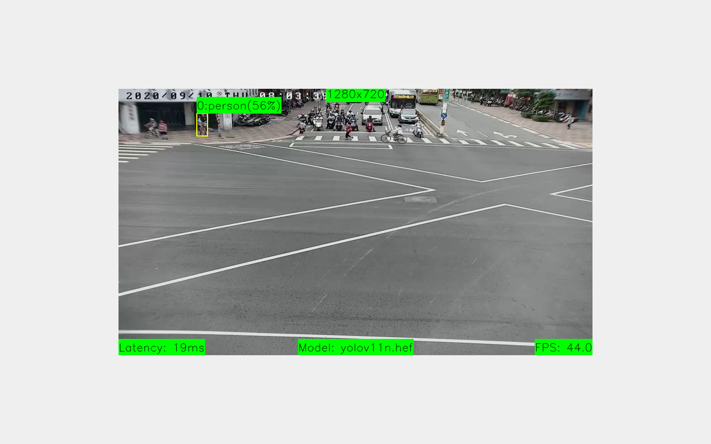

# edge.ai.x86.hailo.demo

A demo project using [edge.ai.x86.hailo.sdk](https://github.com/Avalue-Technology/edge.ai.x86.hailo.sdk), supporting CPU and Hailo-8/8L inference.

## Contents

- **`run-cpu-benchmark.py`**  
  Benchmark multiple models using CPU inference.

- **`run-hailort-benchmark.py`**  
  Run official HailoRT benchmarking tools on multiple HEF models.

- **`run-hef-benchmark.py`**  
  Benchmark multiple models using Hailo inference (custom implementation).

## Installation

Please refer to the [edge.ai.x86.hailo.sdk](https://github.com/Avalue-Technology/edge.ai.x86.hailo.sdk) repository for environment setup and Hailo driver installation.

## Demo Usage

**`main.py`** - Custom demo interface for inference.

### Arguments:

- `--sample-path`: Path to sample files (image or video). Accepts both single file or directory.
- `--model-path`: Path to the model file (`.onnx`, `.tflite`, or `.hef`).
- `--display`: Enable OpenCV window display for visualizing inference results.
- `--loop`: Repeat video sampling in a loop (useful for continuous demos).

### Example:

```bash
python3 main.py \
  --sample-path=sdk/samples/videos/demo.mp4 \
  --model-path=sdk/models/object-detection/yolo/onnx/yolov8n.onnx \
  --display \
  --loop
```

## Validation:

- EPC-RPU (i3-1315UE)


- EPC-ASK (N97)


## Execution screenshot



## Live demo recommendation:

Notice: Due to a known memory leak issue in HailoRT v4.21.0, we recommend using the following script for long-running demonstrations to ensure stable behavior:

- [scripts/start-hailo-object-detection.sh](scripts/start-hailo-object-detection.sh)
